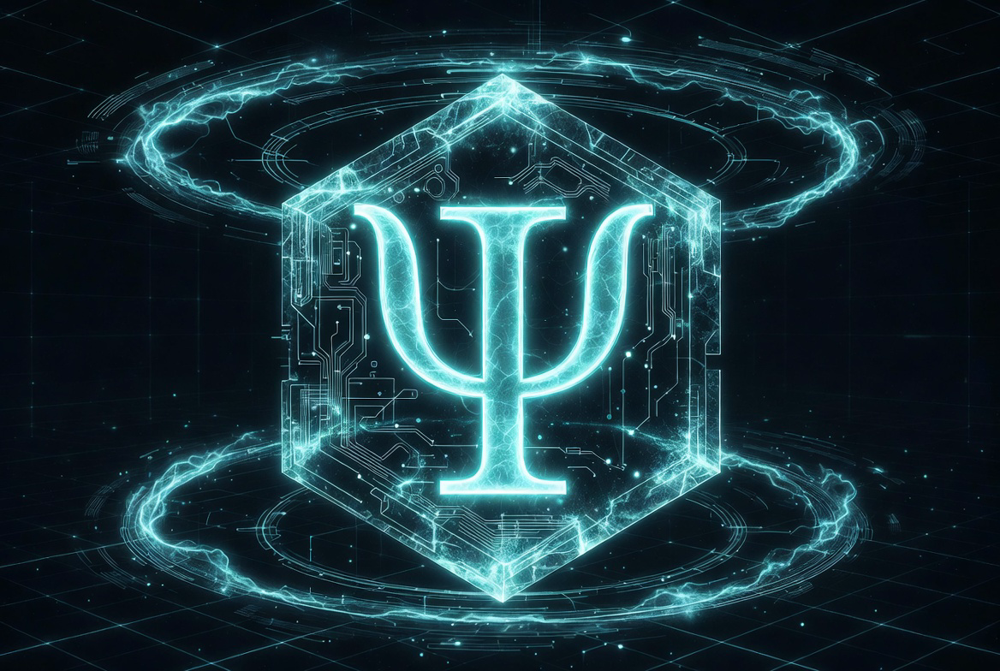

<p align="center">
  <a href="https://github.com/4ndr0666/dupeguru/actions"></a>
  <a href="https://github.com/4ndr0666/dupeguru"></a>
  <a href="https://github.com/4ndr0666/dupeguru/blob/main/LICENSE"></a>
</p>

<h1 align="center" style="font-family: 'Orbitron', sans-serif; letter-spacing: 0.2em; background: linear-gradient(90deg, #00E5FF, #15adad, #157d7d); -webkit-background-clip: text; background-clip: text; color: transparent;">
  DUPEGURU
</h1>
<p align="center" style="font-family: 'Roboto Mono', monospace; color: #15fafa; font-size: 1.15em;">
  NEON-CYAN DUPLICATE ANNIHILATOR // ELECTRIC-GLASS EDITION
</p>

<p align="center">
  
</p>

**Modern Arch Linux tailored fork** of dupeGuru.  
All credit to original authors at [arsenetar/dupeguru](https://github.com/arsenetar/dupeguru) and Voltaic Ideas.

Fast, native C-accelerated duplicate file hunter for pictures, music, and standard files — rendered in full **3l3ctric6lass** glassmorphism with glowing cyan HUD aesthetics.

---

## Table of Contents

- [Build Protocol](#build-protocol)
- [Ignition Sequence](#ignition-sequence)
- [Electric-Glass Interface](#electric-glass-interface)
- [Development HUD](#development-hud)
- [Packaging](#packaging)
- [License](#license)

---

## Build Protocol (CMake Only)

### Prerequisites (Arch Linux)
```bash
sudo pacman -S python python-pyqt5 cmake python-distro python-mutagen \
               python-polib python-send2trash python-xxhash
```

### Ignition Sequence
```bash
git clone https://github.com/4ndr0666/dupeguru.git
cd dupeguru

rm -rf build/
mkdir build && cd build
cmake .. -DCMAKE_BUILD_TYPE=Release
cmake --build . --verbose
sudo cmake --install .
```

**Launch the matrix:**
```bash
dupeguru
```

---

## Electric-Glass Interface

Deep cyan glassmorphism UI with `#00E5FF` / `#15fafa` neon accents, backdrop-blur panels, edge lighting, and intense glow states. Feels like a high-end cyberdeck.

---

## Development HUD

- Python core in `core/` + `qt/`
- C acceleration in `core/pe/modules/` and `qt/pe/modules/`
- Rebuild with the CMake sequence above after changes

---

## Packaging

Clean PKGBUILD template available in the `pkg/` directory.

## License
GPL-3.0 (same as upstream)

---

<div align="center" style="font-family: 'Roboto Mono', monospace; color: #15fafa; background: rgba(10, 24, 38, 0.9); padding: 1.8em; border: 1px solid #00E5FF; border-radius: 12px; max-width: 820px; margin: 3em auto 2em;">
  <pre style="margin: 0; color: #00E5FF; font-size: 1.05em;">
┌──(root💀4ndr0666)-[/dev/akasha]
└─$ <span style="color:#15fafa;">3LECTRIC6LASS MATRIX FULLY ONLINE — DUPLICATES WILL BE PURGED</span>
  </pre>
</div>

Maintained by [@4ndr0666](https://github.com/4ndr0666).  
Issues and PRs welcome in the Logosphere.

─── ⊰ 💀 • - ⦑ 4NDR0666OS ⦒ - • 💀 ⊱ ───
